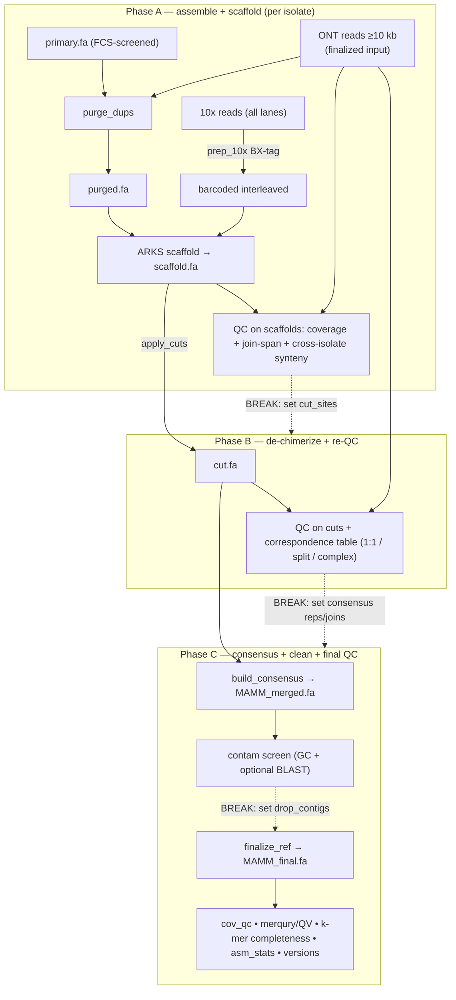

# Reproducible cross-strain reference build — *M. quadricornifera* (MA + MM)

A parameterized Snakemake workflow that takes the two isolates' **primary
assemblies + 10x linked reads + raw ONT `fastq_pass`** and produces a single
**contamination-cleaned cross-strain consensus reference** for pangenome work,
plus a QC suite. Every input and every tunable lives in [`config.yaml`](config.yaml);
the `Snakefile` hard-codes nothing tunable. This doc doubles as the methods draft.

> Status: **not yet run end-to-end.** The values pre-filled in `config.yaml`
> (`cut_sites`, `consensus`, `contam.drop_contigs`) are the 2026-07-22 *draft*
> decisions, recorded for provenance. They are **re-derived at the manual breaks**
> on the final run — see "Running in pieces."

## Pipeline



## Running in pieces (four phases, manual break between each)

```bash
cd rotifer-assembly/autobuild
snakemake -n --sw-deployment-method conda      # dry run / sanity
# software: conda envs (envs/*.yaml) via --sdm conda. FCS-GX runs through its own
# fcs.py wrapper + Singularity (needs `singularity` on PATH; /usr/bin/singularity on
# Cannon) -- no Snakemake container deployment needed.
SLURM="--sw-deployment-method conda --executor slurm -j 200 \
       --default-resources slurm_account=informatics slurm_partition=sapphire"

snakemake $SLURM phase0                        # contamination screen on the primaries
#   >>> review {workdir}/{iso}/prep/{iso}.contam_report.tsv + *.blob.png/*hist.png ,
#       then create {workdir}/{iso}/prep/{iso}.remove.txt (the VERIFIED removal list;
#       `cp {iso}.remove_candidates.txt {iso}.remove.txt` if you accept all; empty = keep all) <<<
snakemake $SLURM phaseA                        # prep_reference (decontam) -> purge -> scaffold -> QC
#   >>> inspect {iso}/qc_scaffold/ + synteny_scaffold/ , then edit config cut_sites <<<
snakemake $SLURM phaseB                        # cut -> re-QC -> correspondence
#   >>> inspect synteny_cut/correspondence.tsv + dotplot , then edit config consensus (+ joins) <<<
snakemake $SLURM                               # Phase C (rule all): consensus -> contam net -> QC
#   >>> review consensus/contam_report.tsv , set config contam.drop_contigs , re-run <<<
```

**Phase 0 (prep reference)** is the decontamination front door, added because the
original FCS-GX (db 2023-01-24) under-detected — it left ~65 Mb of high-GC contigs
in MM incl. 5 circular (complete) bacterial genomes. It screens each **primary**
with a fresh FCS-GX (when a current db is provisioned) **and** a blobtools-style
GC/coverage/BLAST analysis, emitting a candidate report + list + plots for review.
The verified `{iso}.remove.txt` feeds `prep_reference`, so the whole build + QC run
on the decontaminated assembly (not just the final reference). The end-of-pipeline
`contam_screen` remains as a second-line net.
Snakemake reruns only what changed, so editing `cut_sites`/`consensus`/`drop_contigs`
and re-invoking advances cleanly. The three edited config blocks **are** the record
of every manual decision.

## Parameter provenance (every non-obvious value in `config.yaml`)

| param | value | where it comes from |
|---|---|---|
| `primary.*` | `assembly-build-20260723/assemblies-prelim/{MA,MM}.clean_no_adap.p_ctg.fa` | hifiasm `--ont` primary contigs, FCS-GX + FCS-adaptor screened; provenance chain + residual-contamination caveat in `assemblies-prelim/README.md` (Phase 0 finishes decontam) |
| `ont_reads.*` | `source-data/ont-2024-filt/{MA,MM}.ont.filt10k.fastq.gz` | **finalized ≥10 kb ONT** (both 2024 runs pooled per isolate); consumed directly, not re-filtered. Full provenance (source runs, 10 kb = recovered dkhost `FILT` threshold, exact command) in that directory's `README.md` |
| `tenx_R1/R2.*` | 4228-MM-0004 (MA), 0005 (MM), lanes L002+L003 | isolate ID resolved by mapping 10x R2 to hap1 (0.66% vs 1.99% cross); 0006 is a 3rd sample, unused |
| `barcode_len` | 16 | 10x Genomics GEM barcode (chemistry-fixed) |
| `prep.run_fcsgx` | true | fresh FCS-GX via the `fcs.py` wrapper; `fcsgx_tools` curls `fcs.py`+`fcs-gx.sif`, `fetch_gxdb` syncs the current GX db (~470 GB). false = skip (blob screen still runs) |
| `prep.fcsgx_taxid` | 104788 | *M. quadricornifera* NCBI taxon → division `anml:rotifers` (dkhost used 5962; both resolve to rotifers) |
| `prep.fcsgx_manifest` | S3 `…/gxdb/latest/all.manifest` | GX db manifest per the FCS-GX quickstart |
| `prep.blob_gc_flag` | 0.45 | GC above this → window + BLAST + flag candidate. Rotifer host ~0.30; confirmed contaminants 0.66–0.72 |
| `prep.blob_windows_per_contig` / `blob_window_bp` | 20 / 2000 | per-contig taxonomy sampling (parallelized by DB-split, so 20 is fine) |
| `contam.blast_volumes_per_job` / `nt_dbsize` | 10 / 3.98e12 | Phase-0 blast is split across nt's 334 volumes (10/job → ~34 jobs/isolate); `-dbsize` keeps e-values on the full-nt scale |
| `purge.calcuts_opts.MM` | `-l 25 -m 85 -u 180` | MM ONT depth is bimodal (~58×/116×); `calcuts` auto-calls it haploid → manual diploid cutoffs (valley 85). `-d 0` does NOT override. MA auto-detects fine (`""`) |
| `purge.get_seqs_opts` | `-e` | purge haplotypic dups only at contig ends (conservative; purge_dups standard) |
| `purge.self_preset/flags` | `asm5 -DP` | purge_dups self-alignment standard |
| `arks.params` | `c=5 m=50-10000 s=98 z=500 l=4 a=0.7 k=30` | ARKS kmer mode; **VERIFY against the SLURM logs of the run that produced the accepted scaffolds before the final run** |
| `cut_snap_bp` | 20000 | cuts snap to the nearest N-gap within this window (scaffolder joins are N-gaps) |
| `cut_sites.*` | 6 cuts (draft) | **human-chosen at the Phase-A break** from synteny partner-tracks + ONT read-span (cut only where synteny says chromosome-boundary AND no read spans) |
| `synteny.preset` | asm5 | MA vs MM ≈2% (allelic); asm5 handles ≤5%. Use asm20 only for ohnolog-scale (~13%) |
| `synteny.min_aln_bp` | 1e6 | min shared aligned bp to draw a correspondence edge (classify 1:1 / split / complex) |
| `consensus.*` | 8 chromosomes + 9 unplaced (draft) | **human-chosen at the Phase-B break** from `synteny_cut/correspondence.tsv` (best 1:1 representative per chromosome; benign splits are NOT joined unless tiling is confirmed) |
| `contam.gc_flag_high` | 0.50 | rotifer core GC ≈0.30; bacterial contaminants found at ~0.66 (unpl02/unpl03 = MM scaffold6/7) |
| `contam.drop_contigs` | [] (set after review) | reviewed removal list; defaults empty, populate from `contam_report.tsv` |
| `qc.meryl_k` | 19 | merqury standard for ~300 Mb genomes |
| `qc.cov_collapse_ratio` | 1.7 | per-scaffold depth / chromosome-median above this ⇒ collapsed repeat |
| `qc.cov_lowcov_frac` | 0.3 | per-scaffold depth below this × median ⇒ low-coverage flag |
| `qc.telo_*` | 0.25 / 0.30 | terminal dominant-6mer fraction / canonical TTAGGG-family density ⇒ telomere array (replaced the `AATGG` false-positive) |
| `qc.join_qc_*` | 10 Mb / 3 kb / 5 | min scaffold to report / span flank / min spanning reads to "support" a gap |

## Rules → scripts

Standard tools are used directly (no in-house reimplementations): **seqkit** reports
per-contig GC (`fx2tab`) and summary stats (`stats -a`), and selects/drops contigs
(`grep -v -f`) — replacing the old `fasta_select.py`/`asm_stats.py`/`filt_len.sh`. (ONT
read filtering is now an upstream step; the pipeline consumes the finalized reads.)

**Phase 0:** `prep_cov` (minimap2+samtools) · `fcsgx_tools`+`fetch_gxdb`+`prep_fcsgx` (`fcs.py` wrapper + Singularity) · `prep_windows` → `blast_chunk` (scatter over nt volume-chunks) → `blast_merge` · `prep_report`→`blob_report.py` (GC+coverage+BLAST+FCS-GX → report/candidates/blob+hist plots) · `prep_reference` (`seqkit grep -v`).
**Phases A–C:** `prep_10x` (awk BX-tag) · `purge_dups`/`scaffold_arks` (purge_dups + arcs-make) · `split_cuts`→`apply_cuts.py` · `map_ont`+`join_qc`→`join_qc.py` · `synteny`→`paf_dotplot.py`+`synteny_classify.py` (isolate-prefixed) · `build_consensus`→`build_consensus.py` · `contam_screen`→`make_windows.py`+blast+`contam_report.py` · `finalize_ref` (`seqkit grep -v`) · `qc_coverage`→`cov_qc.py` · `asm_stats` (`seqkit stats -a`) · `qc_merqury` (meryl+merqury.sh) · `qc_kmer_completeness`→`kmer_completeness.py`. Kept in-house scripts are the ones with no standard-tool equivalent (custom QC/plot/merge logic).

## Requirements / caveats

- **Software = Snakemake-managed, not paths.** Each rule declares `conda: envs/*.yaml` (`bioinf` minimap2/samtools/seqkit/pysam/matplotlib; `purge_dups`; `arcs`+links; `merqury`+meryl; `blast`); run with `--sdm conda`. FCS-GX is the exception — it uses the `fcs.py` wrapper + Singularity directly (`singularity` on PATH), not a Snakemake-managed container. The pinned env YAMLs are the version record; adjust pins if a version fails to solve.
- **Intermediates are `temp()`** — the barcoded 10x fastq and QC BAMs delete after their consumer; purge_dups/coverage BAMs and paf.gz are removed in-rule. The filtered ONT sets are kept (reused across phases).
- **`prep_10x` is the least-validated step** — the BX-tagging awk assumes a 16 bp R1 prefix barcode with no whitelist correction. **Reconcile against how the accepted scaffolds were actually built before trusting a fresh scaffold.**
- **ARKS output name** is parameter-dependent; `scaffold_arks` requires exactly one file matching `arks.output_glob` and fails loudly otherwise (keeps the run deterministic).
- **`contam.run_blast: true`** does a windowed nt+nr BLAST on GC-flagged contigs — hours on a shared node; set `false` to rely on GC alone.
- Merqury runs **per isolate on its own cut assembly** (not the merged ref) to avoid the cross-isolate confound; interpret QV/completeness with the k-mer-completeness stratification (a purged haploid necessarily "misses" the alternate heterozygous allele).
- **Decontamination is now in-workflow (Phase 0)**, because the upstream FCS-GX (db 2023-01-24) under-detected — it left ~65 Mb of high-GC contigs in MM including 5 circular complete bacterial genomes (`ptg000065c` Reyranella, `ptg000035c` Variovorax @100%, `036c/094c/067c`). Phase 0 re-screens the primaries and removes the verified set before anything else runs; the end-of-pipeline `contam_screen` is a second-line net on the final reference.
- **FCS-GX (fresh) uses the NCBI-documented `fcs.py` route** (matches dkhost's `screen.slurm`): `fcsgx_tools` curls `fcs.py` + `fcs-gx.sif`, `fetch_gxdb` runs `fcs.py db get` (~470 GB → netscratch), `prep_fcsgx` runs `fcs.py screen genome` with `FCS_DEFAULT_IMAGE=fcs-gx.sif`. Needs `singularity` on PATH and a ~512 GB node (sapphire ~990 GB is fine; else `slurm_partition=bigmem`). `run_fcsgx: false` skips it (blob screen still runs; no db/container needed).
- **Phase-0 taxonomy BLAST is split by database, not query.** `blastn` vs nt is dominated by scanning the whole db, so batching the *query* just re-scans nt per batch; instead `blast_chunk` searches the full window set against each of nt's 334 volumes in parallel (`blast_volumes_per_job` per job) and `blast_merge` keeps the best hit per window — nt is scanned once total, spread across ~34 jobs/isolate.
- **`blob_report.py` is a DIY blobtools** (the real blobtools isn't installed): GC vs ONT-coverage scatter (sized by length, colored host/candidate/contaminant) + GC/coverage histograms, with candidates flagged by FCS-GX ∪ high-GC ∪ non-metazoan BLAST.
